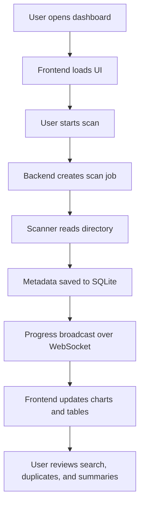

# File Metadata Analyzer

File Metadata Analyzer is a full-stack directory scanning and metadata dashboard built for fast inspection, reporting, and live monitoring. It stores scan results in SQLite, updates the interface in real time, and includes an optional Windows C scanner for course requirements.

## 1. Project Overview

This project scans folders and files, extracts metadata, stores the results in a database, and presents the output in a structured dashboard. It is designed to support background scanning, duplicate detection, search, summary reporting, and system information display.

### Project Goals

- Scan directories reliably and store metadata in SQLite.
- Present scan results through a clear dashboard UI.
- Support real-time updates during scanning.
- Provide advanced analytics such as duplicate and aging reports.
- Keep an optional C implementation available without replacing the Node backend.

## 2. Module-Wise Breakdown

### Backend

- Handles directory scanning, job scheduling, and API responses.
- Stores scan and file metadata in SQLite.
- Broadcasts live scan updates through WebSocket.
- Exposes search, duplicate, aging, export, and system-info endpoints.

### Frontend

- Renders the dashboard, charts, tables, and scan status panels.
- Requests data from the backend and updates the UI dynamically.
- Shows live progress, system information, and file statistics.

### Optional C Scanner

- Scans directories using a Windows-native C implementation.
- Writes into the same SQLite database as the Node backend.
- Integrates with the main architecture while supporting the course-required C implementation.

### API Layer

- Serves the application and connects the frontend to backend logic.
- Supports deployment routing for hosting scenarios such as Vercel.

## Project Structure

```text
.
├── api/
│   └── index.js
├── backend/
│   ├── data/
│   ├── src/
│   │   ├── server.js
│   │   ├── scan.js
│   │   ├── db.js
│   │   ├── hash.js
│   │   ├── owner.js
│   │   ├── fileTypes.js
│   │   └── scanCli.js
│   ├── tests/
│   │   └── system-info.test.mjs
│   ├── package.json
│   └── package-lock.json
├── c_scanner/
│   ├── main.c
│   └── README.md
├── public/
│   ├── app.js
│   ├── dashboard.html
│   ├── index.html
│   ├── landing.html
│   └── styles.css
├── .gitignore
├── package.json
├── package-lock.json
├── README.md
└── vercel.json
```

## 3. Functionalities

- Background directory scanning with progress updates.
- Incremental scan support.
- Duplicate file detection using SHA-256 hashes.
- Advanced filtering by name, owner, type, size, and date.
- Aging analysis for old files.
- Directory summary by depth.
- Export support for CSV and JSON.
- Live watcher status.
- Real system information display.
- Responsive dashboard views for analysis and navigation.

## 4. Technology Used

### Programming Languages

- JavaScript (Node.js and browser-side scripting)
- C (optional scanner module)
- HTML
- CSS

### Libraries and Tools

- Express.js
- SQLite3 / sqlite
- ws (WebSocket)
- chokidar
- cors
- Chart.js

### Other Tools

- GitHub for version control
- VS Code for development
- Windows APIs for owner and file attribute detection

## 5. Flow Diagram



## Local Setup

1. Open a terminal in the `backend` directory.
2. Install dependencies:

```bash
npm install
```

3. Start the backend:

```bash
npm run dev
```

4. Open the application:

```text
http://localhost:4000
```

## API Reference

- `POST /api/scan` - start a scan with `{ path, incremental }`
- `GET /api/status/:jobId` - fetch scan job status and result
- `GET /api/search` - advanced file filtering
- `GET /api/duplicates` - group files by hash
- `GET /api/aging?days=90` - show older files
- `GET /api/dir-summary?depth=2` - folder-level size summary
- `GET /api/export?format=csv|json` - export results
- `GET /api/watch` - inspect watcher state
- `GET /api/system-info` - return host system information

## Testing

Run the backend smoke tests with:

```bash
cd backend
npm test
```

The current test suite validates the system-info and watcher endpoints.

## Optional C Scanner

If your course requires a C implementation, the `c_scanner` folder contains a Windows-native scanner that writes into the same SQLite database.

Build and usage instructions are documented in [c_scanner/README.md](c_scanner/README.md).

## Deployment Notes

This project is built around a persistent Node.js backend with local filesystem access, SQLite persistence, and WebSocket updates. For that reason, the full backend is best hosted on a VM, container service, or local machine.

Recommended deployment approach:

1. Host the frontend on Vercel or another static host.
2. Run the backend on a persistent runtime.
3. Point the frontend API base URL to the backend host if deployed separately.

## Example Commands

```bash
# Start the backend
cd backend
npm run dev

# Run backend tests
npm test

# Start a CLI scan
npm run scan -- "C:\Users\Sumit\Documents"

# Run an incremental CLI scan
npm run scan -- --incremental "C:\Users\Sumit\Documents"
```

## License

This project is created for academic use.
